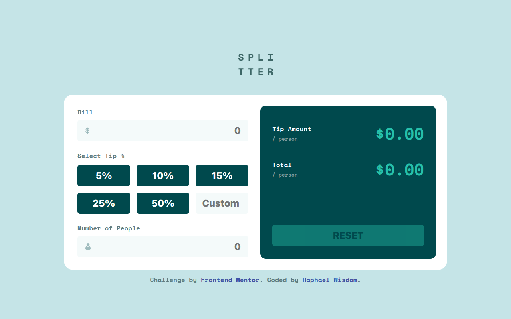

# Frontend Mentor - Tip calculator app solution

This is a solution to the [Tip calculator app challenge on Frontend Mentor](https://www.frontendmentor.io/challenges/tip-calculator-app-ugJNGbJUX). Frontend Mentor challenges help you improve your coding skills by building realistic projects.

## Table of contents

- [Frontend Mentor - Tip calculator app solution](#frontend-mentor---tip-calculator-app-solution)
  - [Table of contents](#table-of-contents)
  - [Overview](#overview)
    - [The challenge](#the-challenge)
    - [Screenshot](#screenshot)
    - [Links](#links)
  - [My process](#my-process)
    - [Built with](#built-with)
    - [What I learned](#what-i-learned)
    - [Continued development](#continued-development)
    - [Useful resources](#useful-resources)
  - [Author](#author)
  - [Acknowledgments](#acknowledgments)

## Overview

### The challenge

Users should be able to:

- View the optimal layout for the app depending on their device's screen size
- See hover states for all interactive elements on the page
- Calculate the correct tip and total cost of the bill per person

### Screenshot

### Links

- Solution URL: [[Add solution URL here](https://your-solution-url.com](https://www.frontendmentor.io/challenges/testimonials-grid-section-Nnw6J7Un7/))
- Live Site URL: [Vercel](https://frontend-mentor-testimonials-grid-section-lake.vercel.app/)

## My process

### Built with

- Semantic HTML5 markup
- CSS custom properties
- CSS Grid
- Flexbox
- Mobile-first workflow
- [React](https://reactjs.org/) - JS library
- [Styled Components](https://styled-components.com/) - For styles

### What I learned

I learnt how to use styled components, but just the basics and would need more improvements.

### Continued development

Would be reading styled components docs and practicing more to improve how I can efficiently use styled components.

### Useful resources

- Styled Components Doc

## Author

- Github - [Raphael Wisdom Chidera](https://github.com/Heisdera)
- Frontend Mentor - [@Heisdera](https://www.frontendmentor.io/profile/Heisdera)
- Twitter - [@Heisdera_Tech](https://twitter.com/Heisdera_Tech)
- LinkedIn - [Raphael Wisdom](https://www.linkedin.com/in/raphael-wisdom-heisderatech?utm_source=share&utm_campaign=share_via&utm_content=profile&utm_medium=android_app)

## Acknowledgments

A special thank you to myself for completing another frontend mentor challenge.
